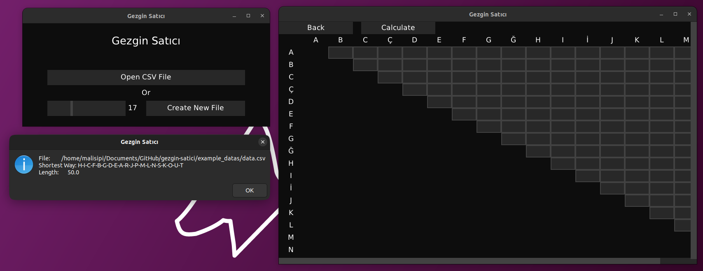

# Gezgin Satıcı

Gezgin Satıcı is the program that can solve [Travelling Salesman Problem](https://en.wikipedia.org/wiki/Travelling_salesman_problem) in a few seconds.

Written with [VLang](https://vlang.io) and [MUI](https://github.com/malisipi/mui).

# License

The program licensed with Mozilla Public License 2.0.

# Disclaimer

This program may not found shortest way. Because the math problem is unsolvable. Also, another algorithms can not calculate perfect shortest way in a few years (e.g. there're 60! possibility for 60 points, calculating every possibility is impossible. There are always shorter way than the shortest way that any algorithm founds). So, this program could be generate longer shortest way than real shortest way. You have been warned.
